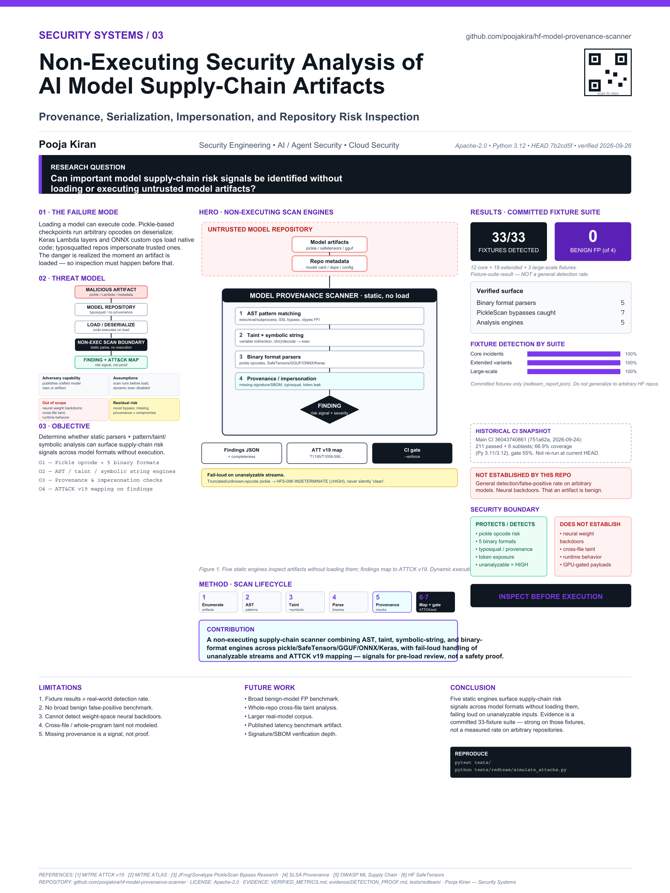

# HF Model Provenance Scanner

> **Non-executing security analysis for AI/ML model supply chains.**

Inspect Hugging Face repositories and local model artifacts for provenance gaps, unsafe serialization, suspicious loaders, dependency risk, impersonation signals, obfuscation, and other supply-chain indicators **without executing untrusted model code**.

Maintained by **Pooja Kiran** ([@poojakira](https://github.com/poojakira)).

[](https://github.com/poojakira/hf-model-provenance-scanner/actions/workflows/ci.yml)
[](https://www.python.org/downloads/)
[](https://opensource.org/licenses/Apache-2.0)

## Overview

`hf-model-provenance-scanner` inspects Hugging Face repositories and local model artifacts for supply-chain risk ΓÇö provenance gaps, unsafe pickle/serialization, suspicious loaders, dependency risk, impersonation, and obfuscation ΓÇö **without executing untrusted model code**. It combines a custom pickle-opcode parser, AST/taint/symbolic-string analysis, and binary-format parsers across pickle, SafeTensors, GGUF, ONNX, and Keras, emitting text/JSON/SARIF for CI gating. It exists because a model download is a software supply chain that teams must be able to inspect before trusting or loading it.

## Verified Snapshot

Current quantitative claims are anchored in [`VERIFIED_METRICS.md`](VERIFIED_METRICS.md).

| Measure | Verified result | Scope |
|---|---:|---|
| Automated tests | **211 passed** | CI on Python 3.10, 3.11, and 3.12 |
| Additional pytest subtests | **6 passed** | Same CI jobs |
| Statement coverage | **66.90%** | Python 3.11/3.12 CI coverage |
| Core incident fixtures | **12/12 detected** | Committed red-team fixture suite |
| Extended variants | **18/18 detected** | Committed extended fixture suite |
| Large-scale fixtures | **3/3 detected** | Committed large-scale fixtures |
| Actionable false positives | **0 across 4 benign samples** | Small committed benign fixture set only |

The aggregate **33/33** result is an internal fixture-suite result, not a universal real-world detection rate. The benign result is likewise limited to the four committed benign samples.

## Security Problem

AI model repositories are software supply chains. A model download can include Python, shell scripts, dependency files, serialized objects, tokenizers, configuration, and binary model formats. Security teams need a way to inspect that material before trusting or deploying it.

This project focuses on a simple boundary:

**Analyze the repository and model artifacts first; do not execute untrusted model code in order to decide whether it is safe.**

## Core Capabilities

The scanner combines static and metadata-driven checks across source, configuration, dependencies, and model artifacts.

- **Unsafe serialization:** pickle-derived artifacts and suspicious deserialization behavior.
- **Model-format inspection:** SafeTensors, GGUF, ONNX, Keras, and common binary model extensions.
- **Suspicious source behavior:** Python AST analysis, shell/config scanning, symbolic string resolution, taint analysis, and obfuscation indicators.
- **Supply-chain provenance gaps:** missing signature, SBOM/AIBOM, and provenance/attestation markers.
- **Repository risk signals:** executable loaders, suspicious entry points, dependency anomalies, and organization/publisher policy checks.
- **Temporal drift:** baseline creation and comparison for model/repository changes over time.
- **Machine-readable output:** JSON, SARIF, text, and HTML reports for CI/CD and review workflows.
- **Optional ATT&CK enrichment:** maps selected finding families to MITRE ATT&CK v19 when the optional `attack-v19-core` package is installed.

## Quick Start

Requires **Python 3.10+**.

```bash
git clone https://github.com/poojakira/hf-model-provenance-scanner.git
cd hf-model-provenance-scanner
python -m pip install -e .
```

Scan a local directory:

```bash
hf-scanner ./model-repo --mode local
```

Scan a Hugging Face repository:

```bash
hf-scanner org/model-name --mode remote
```

Write SARIF for CI or code-scanning workflows:

```bash
hf-scanner ./model-repo --mode local --format sarif --output results.sarif
```

Create a baseline and compare later revisions:

```bash
hf-scanner ./model-repo --mode local --save-baseline baseline.json
hf-scanner ./model-repo --mode local --baseline baseline.json
```

Generate a CycloneDX AI Bill of Materials:

```bash
hf-scanner ./model-repo --mode local --aibom aibom.json
```

Use `--enforce` in CI when incomplete or indeterminate scans must fail rather than pass silently.

## Architecture

```text
Target repository / local directory
        |
        v
File discovery and immutable revision resolution
        |
        +--> Python / shell / config / dependency analysis
        +--> Pickle / SafeTensors / GGUF / ONNX / Keras analysis
        +--> Provenance / signature / SBOM checks
        +--> Taint / symbolic / obfuscation analysis
        +--> Temporal baseline comparison
        |
        v
Normalized findings + severity + remediation
        |
        +--> text
        +--> JSON
        +--> SARIF
        +--> HTML
```

The default scanner path is designed to inspect artifacts without importing or executing model repository code.

**Signature scope:** The scanner flags missing signature evidence and can invoke an installed external verifier for local detached signatures. It does not create model signatures or implement Ed25519 signing.

## Evidence and Reproduction

The repository keeps evidence separate from marketing claims so results can be checked independently.

- [`VERIFIED_METRICS.md`](VERIFIED_METRICS.md) ΓÇö current test, coverage, and red-team counts.
- [`RESUME_EVIDENCE.md`](RESUME_EVIDENCE.md) ΓÇö historical validation snapshots and reconciliation with later CI growth.
- [`evidence/DETECTION_PROOF.md`](evidence/DETECTION_PROOF.md) ΓÇö committed detection evidence and reproduction notes.
- [`tests/redteam/`](tests/redteam/) ΓÇö attack and benign fixtures used for regression testing.
- [`benchmarks/scan_perf.py`](benchmarks/scan_perf.py) ΓÇö performance regression harness.

Reproduce the principal regression checks with:

```bash
pytest tests/
python tests/redteam/simulate_attacks.py
python tests/redteam/extended_attacks.py
python tests/redteam/test_large_scale.py
```

`tests/redteam/test_detection_counts.py` pins the advertised fixture totals so changes to those counts fail regression tests.

## Threat Model & Scope

| Area | Current status | Boundary |
|---|---|---|
| Scanner formats | Python, shell/config/dependency files, pickle-derived files, SafeTensors, GGUF, ONNX, and Keras paths are implemented | Format support does not imply complete attack coverage |
| Provenance checks | Missing signature, SBOM, and provenance markers can be flagged | Missing evidence is a risk signal, not proof of compromise |
| Red-team fixtures | Committed attack fixtures are detected by the current suite | Fixture results must not be generalized to arbitrary real-world repositories |
| Latency | A benchmark harness exists | Do not claim a production P99 without a current reproducible result artifact |
| False positives | Four committed benign samples produced zero actionable findings in the verified snapshot | Do not claim a universal 0% false-positive rate |
| Sandbox mode | Disabled | The project does not claim verified isolation for executing untrusted model code |

## MITRE ATT&CK v19 Enrichment

ATT&CK mapping is an **optional library component**, not part of the default scanner CLI output path.

The implementation lives under `scanner/attack_mapping/` and requires the optional [`attack-v19-core`](https://github.com/poojakira/attack-v19-core) dependency. The current enricher covers **10 finding families** through `ATTACKEnricher._rule_table`; it does not map every possible scanner finding.

Install the optional dependency and export an ATT&CK Navigator layer:

```bash
pip install -e ".[attack]"
python -m scanner.attack_mapping.reporter --output navigator_layer.json
```

Selected mappings include supply-chain compromise, unsafe Python execution, impersonation, dependency confusion, credential exposure, and model-card or tokenizer manipulation. See the implementation and tests for the exact current mapping table.

## Output and CI Use

The CLI supports:

```text
--format text|json|sarif|html
--fail-on critical|high|medium|low|info|never
--enforce
--revision <branch|tag|sha>
--baseline <file>
--save-baseline <file>
--aibom <file>
--no-network
```

This makes the scanner usable as a local review tool, a CI security gate, or an evidence-producing component in a broader model-governance workflow.

## Research Poster

**Security Systems / 03 ΓÇö Non-Executing Security Analysis of AI Model Supply-Chain Artifacts**

[](poster/poster_36x48.pdf)

The 36 × 48 in technical poster summarizes the system, threat model, validation approach, and evidence boundaries. Metrics on the poster are intended to remain tied to committed evidence artifacts rather than generalized deployment claims.

## Fail-Closed Isolation Executor

The existing `--sandbox` subprocess backend is **not** isolation. This adds an
explicit execution boundary in `scanner/isolation/executor.py`:

- **`ExecutorBackend` interface + `RestrictedSubprocessBackend`** enforcing, portably (Windows/POSIX):
  wall-clock timeout with kill, output-size caps, working-dir confinement, and env scrubbing.
- **POSIX-only (guarded):** `resource.setrlimit` for CPU/AS/NOFILE/FSIZE plus `os.setsid`.
- **Fail-closed:** refuses to run untrusted code without an explicit acknowledgment flag.

**UNVERIFIED — requires Linux host + KVM:** committed seccomp / namespace / cgroup-v2 profiles
under `scanner/isolation/profiles/` and a gVisor / Firecracker backend **stub** that raises
`NotImplementedError`. These kernel-isolation pieces are inert on Windows and are **not**
verified here. True kernel isolation is **not** verified on Windows.

Tests: `tests/test_executor.py` = **12 passed, 1 skipped** (the POSIX-only test is skipped on
Windows). Full suite: **223 passed / 1 skipped, no regressions**. See
[`scanner/isolation/README.md`](scanner/isolation/README.md) for the verified-vs-Linux matrix.

## Supply-Chain Signing & Attestation

`.github/workflows/supply-chain-attest.yml` adds cosign **keyless** image signing, a signed
CycloneDX SBOM attestation, SLSA build provenance, and a verify gate.

**UNVERIFIED locally — requires a CI runner with OIDC + registry:** this workflow has not been
executed in the local dev environment. The **verified** part is the existing CycloneDX AIBOM
generator (`scanner/aibom_generator.py`); the signing/attestation pipeline is not verified here.
See [`docs/supply-chain/SIGNING.md`](docs/supply-chain/SIGNING.md).

## Additional Documentation

- [`INCIDENT_RUNBOOK.md`](INCIDENT_RUNBOOK.md) ΓÇö incident-response guidance for the scanner.
- [`docs/API_VERSIONING.md`](docs/API_VERSIONING.md) ΓÇö CLI and API stability notes.
- [`docs/PERFORMANCE_BASELINE.md`](docs/PERFORMANCE_BASELINE.md) ΓÇö performance-baseline documentation.
- [`evidence/DETECTION_PROOF.md`](evidence/DETECTION_PROOF.md) ΓÇö red-team detection evidence.
- [`RESUME_EVIDENCE.md`](RESUME_EVIDENCE.md) — auditable résumé-claim evidence.
- [`VERIFIED_METRICS.md`](VERIFIED_METRICS.md) ΓÇö current quantitative evidence anchor.

## Maintainer

**Pooja Kiran**  
GitHub: [@poojakira](https://github.com/poojakira)

This repository is maintained as an evidence-backed security-engineering project. Claims should remain reproducible from committed code, tests, CI results, and evidence artifacts.

<!-- repo-verification:start -->
## Verification update — 2026-09-30

- **Scope:** Account-wide `poojakira` repository pass covering source/configuration, CI/release workflows, security-hygiene gates, dependency/SAST controls, and documentation consistency.
- **Remediation:** Marked the inert webhook test secret as a test-only S105 exception instead of weakening the rule globally; CI then passed.
- **Verification state:** CI, Production Gate, Security Hygiene, Documentation Integrity, and Admission Service Container checks completed successfully after the fix.
- **Security note:** The exception is limited to the inert test fixture; production secret-handling rules remain enforced.
- **Evidence boundary:** This update records repository and GitHub Actions evidence observed during the pass. It is not a claim of independent penetration testing, production deployment, or zero residual risk.
<!-- repo-verification:end -->
